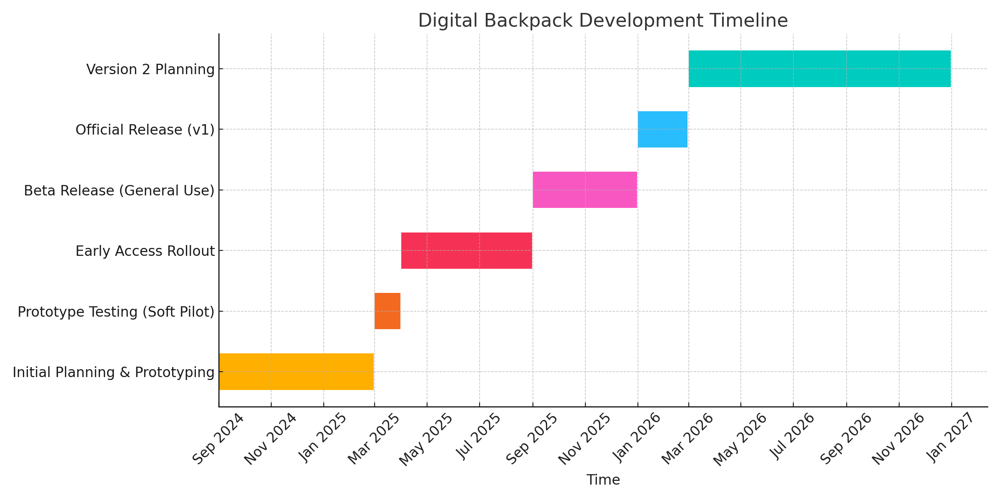

## Future Plans

### Description

Looking ahead, I intend to build on the institutional and sector momentum of my current projects by expanding the Digital Backpack and deepening AI integration in a way that is ethical, inclusive, and evidence-based.

**Key priorities include:**

- Enhanced Digital Backpack analytics – introducing longitudinal tracking (opt-in) to measure individual and cohort progress over time, enabling more personalised support.
- AI for formative assessment – piloting AI-assisted feedback mechanisms within the Backpack so learners can receive tailored, confidence-building guidance alongside their diagnostic results.
- Expanded sector engagement – publishing and presenting on the Backpack model, LinkedIn Learning integration, and AI adoption strategies to contribute to national practice and policy discussions.
- Staff capacity building – developing a streamlined “AI in Teaching” micro-course for staff to address both technical and ethical aspects of generative AI use.
- Evidence-led advocacy – continuing work in the AI-SIG and digital capability forums to influence policy on accessibility, privacy, and censorship in institutional tools.

*Figure C.1 Digital Backpack Diagnostic development timeline*

### Reflection

My work so far has shown me that change in digital capability is most sustainable when embedded into existing workflows and tied to clear benefits for users. For future projects, I will build in structured evaluation from the outset, ensuring that success measures capture both hard data (usage, completion rates) and softer outcomes (confidence, inclusion, satisfaction).

I also plan to be more intentional about disseminating lessons learned beyond Greenwich, including open resources and case studies, to ensure that effective practice benefits the wider sector.

### Evidence

- Appendix D – Current Draft Conference Proposal
- Appendix G – AI as a Constant Companion (conference abstract)
- Appendix E – SHIFT Conference 2025 materials

---
