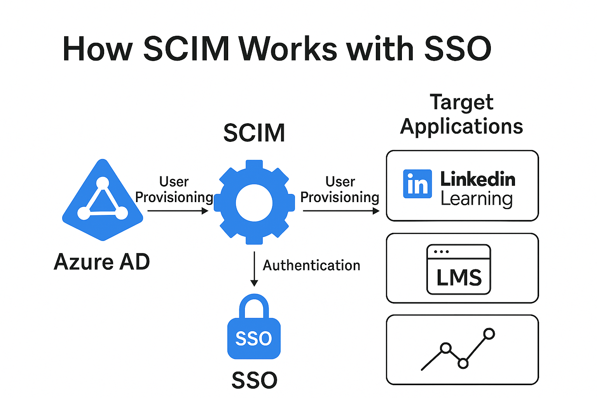
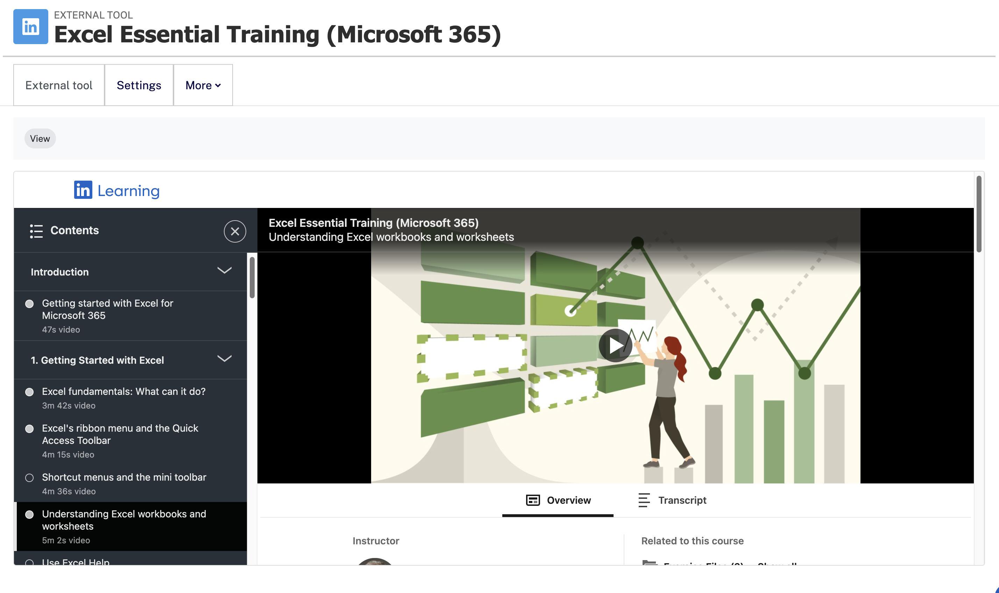
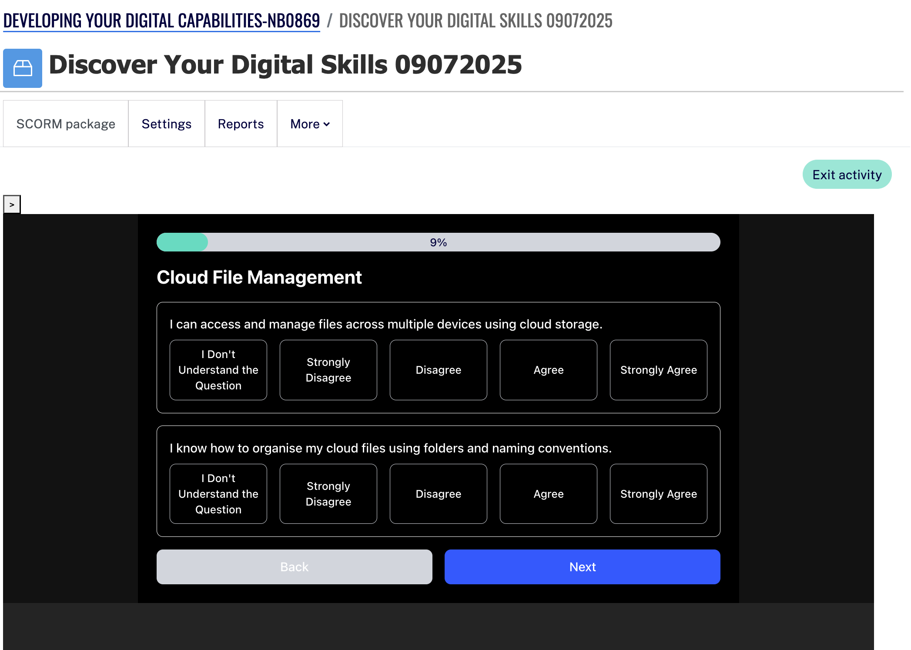
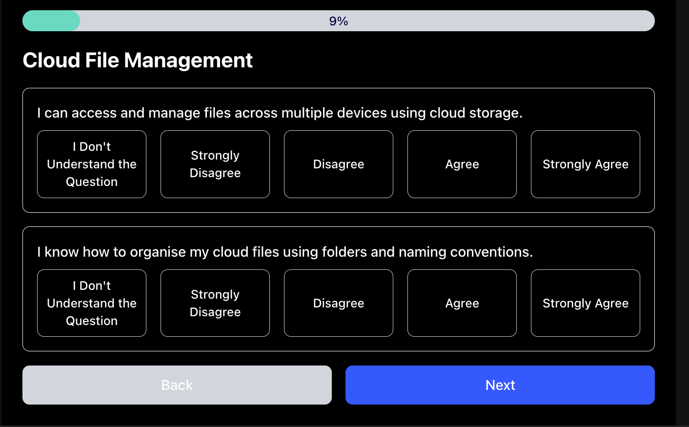
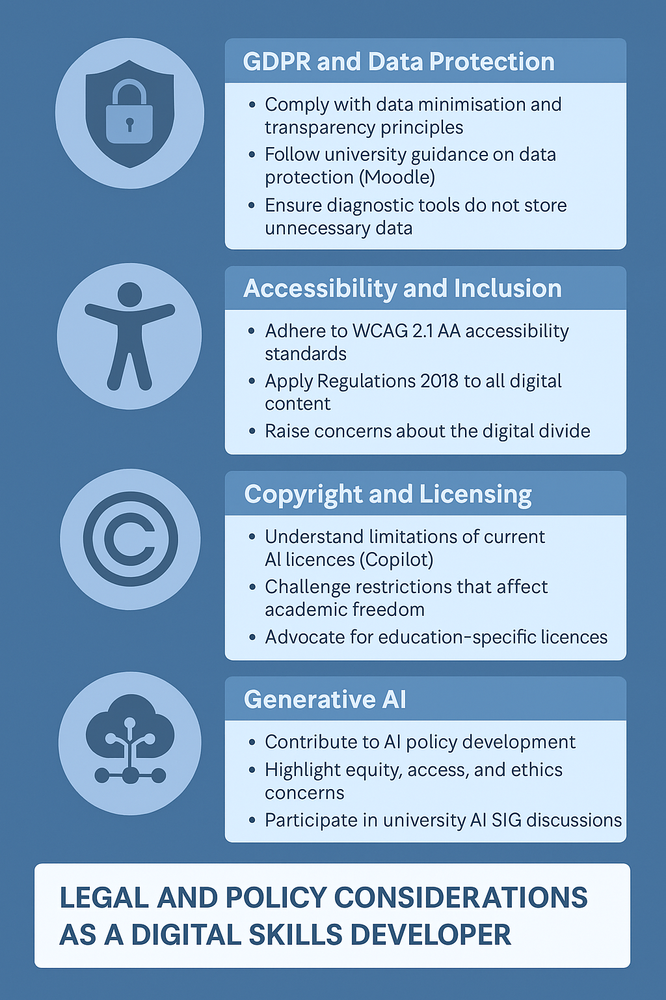

## Sections

- [Contextual Statement](#contextual-statement)
- [Core Area 1: Operational Issues](#core-area-1-operational-issues)
  - [Core Area 1a: Understanding the Constraints and Benefits of Different Technologies](#core-area-1a-understanding-the-constraints-and-benefits-of-different-technologies)
  - [Core Area 1b: Technical Knowledge and Ability in the Use of Learning Technology](#core-area-1b-technical-knowledge-and-ability-in-the-use-of-learning-technology)
  - [Core Area 1c: Supporting the Deployment of Learning Technologies](#core-area-1c-supporting-the-deployment-of-learning-technologies)
- [Core Area 2: Teaching, learning and/or assessment processes](#core-area-2-teaching-learning-andor-assessment-processes)
  - [Core Area 2b: An Understanding of Your Target Learners](#core-area-2b-an-understanding-of-your-target-learners)
- [Core Area 3: The Wider Context](#core-area-3-the-wider-context)
  - [Core Area 3a: Understanding and Engaging with Legislation, Policies, and Standards](#3a-understanding-and-engaging-with-legislation)
  - [Core Area 3b: Understanding and Engaging with Policies and Standards](#3b-understanding-and-engaging-with-policies-and-standards)
- [Core Area 4: Communication](#core-area-4-communication)
- [Specialist Areas](#specialist-areas)
  - [Specialist Area 1](#specialist-area-1---linkedin-learning-and-moodle-integration)
  - [Specilaist Area 2](#specialist-area-2-the-digital-backpack--confidence-based-skills-assessment)
- [Advanced Areas: Strategic Leadership in Digital Capability, AI Policy, and Institutional Change](#advanced-areas-strategic-leadership-in-digital-capability-ai-policy-and-institutional-change)
- [Future Plans](#future-plans)
- [Biblography](#biblography)
- [Thanks](#thanks)
- [Confirmation](#confirmation)

## Contextual Statement

I am currently a digital skills developer at the University of Greenwich, where I lead institutional efforts to improve digital capability, primarily, among students and, some staff. My work is grounded in the belief that learning technology is not just a set of tools, but a form of literacy essential to equity, empowerment, and future-readiness in higher education.

I have not previously completed Certified Membership of the Association for Learning Technology (CMALT), but I strongly identify with its values – particularly the commitment to exploring the interplay between technology and learning, and to supporting ethical, accessible, and inclusive practice. My Senior CMALT submission builds directly on the critical reflection and pedagogical development undertaken as part of my PGCert in Teaching in Higher Education, where I shifted from competence-based delivery to confidence-based facilitation, and began to see myself more as an educator than a technologist.

One of the cornerstones of my practice is the Digital Backpack, a university-wide initiative that I have led from inception. Designed to address widening participation, digital inclusion, and curriculum-embedded skills development, the Backpack includes a formative, confidence-based diagnostic tool aligned with both the Jisc Digital Capabilities Framework (Jisc, 2022) and the UK Government’s Essential Digital Skills Framework (Department for Education, 2019). I have led cross-departmental collaboration – including with the Moodle and branding teams – negotiated access to institutional systems, and worked directly with students to co-design inclusive interventions.

In parallel, I have overseen the integration of LinkedIn Learning using the System for Cross-domain Identity Management (SCIM) protocol, improving provisioning, segmentation, and analytics to support data-informed strategy. This work has enabled more focused engagement initiatives and greater value realisation from the institution’s investment.

I also mentor both students and staff – for example, supporting a Business School undergraduate exploring careers in learning platforms, and advising staff colleagues on digital capability development and resource design. These mentoring experiences have strengthened my commitment to developing others and fostering leadership outside formal hierarchies.

My impact spans local, institutional, and sector levels. Locally, I deliver inclusive workshops and consultations that build agency and digital confidence. Institutionally, I contribute to strategic conversations aligned with our 2030 “digital-first” vision (University of Greenwich, 2022). Sector-wide, I have spoken at events like the SHIFT Conference 2024, contribute to an internal Artificial Intelligence (AI) Special Interest Group (AI-SIG), and have helped shape guidance on the ethical use of generative AI in teaching and learning.

I also support evidence-based decision making by evaluating tools such as the Jisc Digital Capabilities Tool, LinkedIn Learning, and Microsoft Teams Premium – particularly for their AI affordances and accessibility features. These evaluations have influenced purchasing, policy, and practice at Greenwich.

This portfolio represents the next step in my professional development – from practitioner to institutional influencer. Through sustained work in learning technology, I have developed a strong strategic voice, a focus on inclusion and confidence-building, and a desire to contribute not only to my institution, but to national conversations about the ethical, inclusive, and purposeful use of digital tools in higher education.

---

## Core Area 1: Operational Issues

### Core Area 1a: Understanding the Constraints and Benefits of Different Technologies

As the institutional lead for LinkedIn Learning at the University of Greenwich, one of my primary responsibilities has been to ensure we derive maximum value from our investment in the platform. LinkedIn Learning offers wide-ranging skills development opportunities for both students and staff, particularly in areas such as digital literacy, employability, and personal development. However, it is a third-party platform and not natively integrated with the university’s core systems.

A key challenge we encountered was the fragmentation between LinkedIn Learning and Moodle, our primary Virtual Learning Environment (VLE). Tutors were required to manage content and learners across two systems, leading to duplicated effort, difficulties in tracking student progress, and inconsistent user experiences. Despite this, there was clear interest from tutors in making better use of LinkedIn Learning.

> "It would be great to make a brief [LinkedIn Learning] pathway... So both students and staff could have quick way of learning more about it..." – Tutor query about LinkedIn Learning

This quote reflects some of the confusion that exists among tutors about LinkedIn Learning. Because Moodle is the university’s established VLE, introducing LinkedIn Learning as a standalone service required additional training, which could be mitigated through integration.

Tutor interest became a vital lever in securing resources and institutional support for the project. Email correspondence regularly included phrases such as:

> "Getting a lot of interest from tutors in the ability to start importing LinkedIn Learning modules." – Email extract from Stuart Smith to Moodle team, 25 November 2024

To address these issues, I led the integration of LinkedIn Learning into Moodle using Learning Tools Interoperability (LTI) 1.3. This enabled tutors to embed learning resources directly into their course areas, creating a more seamless experience for students, with progress monitored centrally via Moodle.  
[Appendix A – Step-by-Step Guide: Embedding a LinkedIn Learning Course in Moodle](#a--step-by-step-guide-embedding-a-linkedin-learning-course-in-moodle)

In selecting and implementing this solution, I evaluated it against several key criteria:

- **Interoperability** – using an established standard that enables secure, role-aware data exchange  
- **Sustainability** – reducing duplicate account management and ensuring the solution could scale  
- **Tutor workload** – simplifying access to curated content and freeing time for teaching and support  
- **User engagement** – embedding content directly into courses to encourage consistent uptake

However, the Moodle team raised valid concerns around data protection, particularly regarding the exchange of information between Moodle and LinkedIn Learning. This was escalated to the University’s Data Protection Office. Following a review, we received confirmation that existing contracts and policies adequately covered this use case. Although I had assumed this to be the case, I welcomed the scrutiny—it served as a critical reminder to surface data protection considerations at the outset of any integration project.

> "That’s great news that the data protection side is all ok..." – Moodle team email confirmation, 27 November 2024



In parallel, I supported the adoption of the **System for Cross-domain Identity Management (SCIM)** protocol to automate user account provisioning. SCIM enables synchronisation of role-based access using data from HR and student record systems. While Single Sign-On (SSO) supports authentication, SCIM adds granular control, audience segmentation, and more tailored communications and learning pathways.

These choices came with constraints. Moodle’s limited support for deep linking via LTI 1.3 required significant workaround development and tutor support documentation. The SCIM rollout involved coordination across IT, HR, and third-party vendors, as well as alignment with institutional data governance processes.

The integration has been piloted with a small group of tutors. While formal evaluation is ongoing, initial anecdotal feedback has been positive. Tutors have noted the simplicity of embedding resources and the benefit of being able to track student engagement within Moodle. Interest has also grown among professional services colleagues, particularly from HR, who now view LinkedIn Learning as a cost-effective CPD platform.

#### Reflection

This project sharpened my understanding of what *fit for purpose* means in learning technology. The most effective tools are not necessarily the most feature-rich—but those that integrate cleanly into existing systems and workflows. Integration can fundamentally change how a tool is perceived—transforming LinkedIn Learning from an optional add-on into a valued part of course delivery.

I initially underestimated how even small usability barriers could inhibit adoption. Once we removed the friction of switching platforms, tutors were far more willing to engage with LinkedIn Learning. This affirmed that technology decisions are only as successful as their uptake—and adoption depends on context, usability, and clarity.

Gaining strategic support required me to communicate long-term benefits in a language aligned with institutional priorities such as our **“digital-first by 2030” strategy** [see Contextual Statement](#contextual-statement) and workload reduction goals. It strengthened my cross-functional collaboration skills and reminded me of the importance of framing technical developments in pedagogical and operational terms.

With improved data availability, the next phase will involve analysing how usage of the platform evolves among students and tutors. These insights will guide and justify further development, including the potential for advanced SCIM/LTI features such as trigger-based recommendations and adaptive learning pathways.

This work also ties into the technical reflections presented in [Core Area 1b](#core-area-1b-technical-knowledge-and-ability-in-the-use-of-learning-technology), the deployment context in [Core Area 1c](#core-area-1c-supporting-the-deployment-of-learning-technologies), and the wider institutional strategy explored in [Core Area 2b](#core-area-2b-an-understanding-of-your-target-learners).

It exemplifies my commitment to learning technologies that empower autonomy, reduce barriers, and align with strategic goals for inclusive, accessible digital education.

### Core Area 1b: Technical Knowledge and Ability in the Use of Learning Technology

#### Description Core Area 1b

In my role as the Digital Skills Developer at the University of Greenwich, I apply a wide-ranging technical skill set across institutional platforms, open web technologies, and emerging AI tools. My core responsibilities include developing and embedding learning technologies that are scalable, inclusive, and strategically aligned with the university’s ambition to become a digital-first institution by 2030.

I support the creation, delivery, and integration of learning content using:

- **Moodle** (including Sharable Content Object Reference Model (SCORM) packaging and plugin integration)  
  
- **Microsoft 365** (Teams, OneNote, Word, Excel, PowerPoint, OneDrive, Outlook, and Copilot)
- **LinkedIn Learning**, including LTI 1.3 integration for Moodle  
  LTI 1.3 integration between Moodle and LinkedIn Learning allows secure, standards-based single sign-on and content launch with user-level tracking. To configure it, an admin must register LinkedIn Learning as an external tool provider in Moodle using client credentials from LinkedIn Learning’s admin portal and enable LTI 1.3 services in both systems (Microsoft, 2023)
- **Custom tools for diagnostic and formative assessment**, most notably the Digital Backpack  
  

I hold a Master’s degree in Computing Science, where my dissertation focused on accessibility and Human–Computer Interaction (HCI). Earlier in my career, I contributed to Jisc-published research on accessibility (Smith, 2002) in education – work that continues to influence my values-led approach to inclusive technology adoption.

As part of my ongoing professional development, I completed the **Digital Teaching and Technology Enhanced Learning in Higher Education** module (ACAD-1441-M02-2024-25) at the University of Greenwich ([course link](https://moodlecurrent.gre.ac.uk/course/view.php?id=107625))(University of Greenwich, 2025). This module, part of my PGCert, deepened my understanding of how learning technologies interact with pedagogical design. It also helped me stay current with sector practices, particularly in relation to accessibility, feedback, and student engagement.

#### Reflection Core Area 1b

My technical practice is rooted in the principle that accessibility is not a feature – it is a foundation. This philosophy informs both the tools I build and the formats I advocate. Structured textual formats like Markdown, semantically formatted Word documents, and HTML are not only accessible across devices and assistive technologies – they are also highly compatible with AI-powered tools like Copilot. Where learning content is structured well, tools such as Copilot are more likely to enhance clarity and engagement; where it is poorly structured, AI often compounds confusion.

In a sector increasingly dependent on multimedia and automation, I continue to champion open, portable, and inclusive design. However, I have also learned to balance idealism with pragmatism. SCORM, for example, is not the most modern standard, but its compatibility with Moodle allows me to deploy tools quickly and at scale while the institution upgrades its infrastructure.

A key example of impact is the development of the Digital Backpack capabilities assessment tool. Originally conceived as a judgement-based quiz, the tool was redesigned as a confidence-based diagnostic in direct response to feedback from colleagues across the Academic Learning Enhancement (ALE) team, accessibility specialists, and digital skills practitioners. Their insight highlighted the potential for judgemental assessment models to alienate students – particularly those who lacked confidence or came from non-traditional learning backgrounds.

I led the technical and pedagogical redesign to ensure the new tool was aligned with the **Jisc Digital Capabilities Framework** and the **UK Government’s Essential Digital Skills Framework**. The resulting confidence-based diagnostic now forms the basis of the university’s approach to digital skills assessment for incoming students. This work is described further in [Specialist Area 2](#specialist-area-2-the-digital-backpack--confidence-based-skills-assessment).

This development is significant because there was previously no mechanism for diagnosing digital capability gaps at the point of entry. Given that all students are expected to engage with core digital tools from day one, the absence of diagnostic data created a serious equity issue. Without it, there was no effective way to allocate support, design inclusive interventions, or prioritise resources. By implementing the Digital Backpack as a formative, scalable tool, I have helped position it as a key institutional asset – providing a foundation for targeted upskilling, improved onboarding, and longer-term student success.

This work also complements the LTI and SCIM integration efforts described in [Core Area 1a](#core-area-1a-understanding-the-constraints-and-benefits-of-different-technologies), and the deployment support explored in [Core Area 1c](#core-area-1c-supporting-the-deployment-of-learning-technologies).

It embodies several of the core CMALT principles: understanding the interplay between technology and learning, advocating for sustainable and inclusive practice, staying current with evolving tools, and working across professional boundaries to communicate and embed effective solutions.

---

### Core Area 1c: Supporting the Deployment of Learning Technologies

#### Description

At the University of Greenwich, I play a central role in supporting the deployment of learning technologies for both students and staff. This includes not only implementing tools such as SCORM packages, LinkedIn Learning, and Microsoft Copilot, but also designing and refining systems that address institutional gaps – most notably the Digital Backpack.

The Digital Backpack was developed in response to a significant shortfall in how digital skills were assessed and supported for students entering the university. While Greenwich had previously subscribed to the Jisc Digital Capabilities Tool, its use was not embedded in a strategic or inclusive way. It also carried assumptions about user competence that made it difficult for students with limited digital experience to engage effectively.



In contrast, my approach has been to develop a tool that assumes minimal digital fluency on entry. I aligned the Digital Backpack’s capabilities assessment with both the Jisc Digital Capabilities Framework and the UK Government’s Essential Digital Skills Framework. Rather than relying on off-the-shelf solutions – which were prohibitively expensive and misaligned with our needs – I created a bespoke, confidence-based diagnostic through low-cost prototyping. This allowed me to demonstrate proof of concept and secure institutional buy-in for a tool that better meets the needs of our student population.

I wanted widespread colleague involvement from the start of the project and was particularly grateful for support from the AI SIG at the University of Greenwich, who suggested that I develop generative AI prompts for the question creation. The following example prompt, contributed by Assoc. Prof. Gerhard Kristandl (15 January 2025), was used in early prototyping:

```markdown
> #### Prompt Template
> **Introduction**  
> You are an EDUCATIONAL PSYCHOLOGIST skilled in creating engaging and unbiased self-assessment tools that measure practical digital literacy.
>
> **Context:** This framework helps individuals accurately assess their digital capabilities without oversimplifying or gaming the system.
>
> **Task Description**  
> Create a simple, informative Q&A framework using a 1–2–3 rating system:  
> 1: Awareness level (basic familiarity with digital tools, limited cross-application of knowledge)  
> 2: Moderate capability (proficient within one platform, struggles with unfamiliar tools or transitions)  
> 3: Proficiency (able to adapt, transfer skills across platforms, learn new tools independently)
>
> **Framework Development**  
> - Design 10–15 real-world scenarios that reflect tasks like file management, collaboration, and troubleshooting.  
> - Include questions requiring reflection on past experiences and decision-making.
>
> **Rating System**  
> - Define clear, meaningful distinctions between levels. Avoid binary or leading questions.  
> - Include situational complexity to assess deeper fluency.
>
> **Anti-Gaming Measures**  
> - Use problem-solving prompts that reduce the chance of easily guessing the "highest" response.  
> - Include rationale fields for users to explain their answers.
>
> **Outcome Expectations**  
> - Provide 10–15 Q&As, 1–2–3 rating definitions, and interpretation guidance.
>
> **Example Scenario**  
> _"You receive a file in a format incompatible with your current software. What do you do?"_  
> 1: Ask a colleague for help or guidance.  
> 2: Try built-in conversion tools or search for an easy workaround.  
> 3: Independently research external solutions and verify the converted file.
```

This prompt approach saved time and reduced bias in question generation by creating consistency that could be applied programmatically. However, while generative AI was used for prototyping, academic review and validation were essential. Feedback from colleagues ultimately led to a shift from open scenarios to a Likert-based confidence scale.

A potential barrier to deployment was the university’s Digital Strategy (University of Greenwich, 2024), which prioritises the use of existing systems. While this policy is practical in many contexts, it did not accommodate the need for a tailored diagnostic tool to bridge systemic gaps. By working within these constraints and demonstrating both demand and feasibility, I progressed from prototype to live pilot without conflicting with institutional values.

#### Collaboration and Impact

One of the most impactful aspects of this work has been its collaborative development. I worked closely with colleagues across the Academic Learning Enhancement (ALE) team – who support academic staff development – to align efforts. Through regular meetings and informal knowledge exchange, we identified shared goals and accelerated tool development.


This collaboration led to a shared GitHub architecture, where different versions of the Digital Backpack assessment tool could be branched and adapted to suit distinct audiences. One branch now serves the ALE team’s tutor-facing needs, another supports the student-facing digital skills offer, and a third is under development for Professional Services to support staff induction. This branching supports sustainability and ensures the tool evolves with institutional needs.

Beyond technical implementation, this work is helping to shift the university’s cultural framing of digital skills. By embedding the Digital Backpack in the upcoming curriculum framework, digital assessment becomes a structured expectation rather than an optional extra. Students will complete the diagnostic on arrival, enabling targeted support, early intervention, and a clearer sense of digital expectations. This marks a shift from vague literacy concepts to scaffolded digital citizenship.

#### Reflection Core Area 1c

This experience reaffirmed the value of open collaboration, low-cost prototyping, and values-driven development. While policy constraints limited off-the-shelf options, I worked creatively within them by advocating for a fit-for-purpose tool backed by data and dialogue.

I also deepened my appreciation for the diversity of learners and staff. Some students arrive with limited exposure to digital tools beyond passive smartphone use; some staff begin with low confidence. Recognising this helped me frame digital skills as an entitlement, not assumed knowledge. That framing informed both design and deployment.

This deployment work aligns with the CMALT principles of collaboration, critical reflection, and sustainable practice. By embedding a flexible, inclusive assessment tool across departments and user groups, I have contributed to a more coherent and equitable digital experience at Greenwich – one that begins at induction and grows throughout a student’s academic journey. The work complements [Core Area 1a](#core-area-1a-understanding-the-constraints-and-benefits-of-different-technologies) and [Core Area 1b](#core-area-1b-technical-knowledge-and-ability-in-the-use-of-learning-technology), and is expanded on in [Specialist Area 2](#specialist-area-2-the-digital-backpack--confidence-based-skills-assessment).

---

## Core Area 2: Teaching, learning and/or assessment processes

### Core Area 2a: An Understanding of Teaching, Learning, and/or Assessment Processes

#### Description Core Area 2a

As a Digital Skills Developer at the University of Greenwich, I design and deliver inclusive, scaffolded digital skills sessions that support both students and staff in developing practical capabilities. My teaching approach is grounded in constructivist, humanist, and progressivist principles. Through my PGCert in Teaching in Higher Education, I have deepened my theoretical understanding and evolved my practice to emphasise co-creation, confidence-building, and critical engagement.

#### Workshop Design and Delivery

I have created a developing programme of digital skills workshops, delivered online and aligned with the university's curriculum framework. These include sessions on Copilot, Word, Excel, Outlook, Teams, OneDrive, digital wellbeing, and digital security. Importantly, these sessions are tool-agnostic. The focus is on transferable digital skills, using Microsoft 365 tools only as accessible examples of what the university provides.

Each session is carefully scaffolded: beginning with a brief introduction, followed by practical tasks based on realistic, curriculum-relevant scenarios. These tasks are chunked into manageable steps, especially in sessions that target essential digital skills. Jargon is minimised. I often describe AI interactions in natural terms – for example, replacing the word "prompt" with "question" to reduce barriers to understanding.

A notable moment came when a mature student, often bullied for their lack of digital skills, began crying during a Copilot session – not out of distress, but because they felt empowered for the first time to understand complex university systems using a tool that spoke their language. This experience reflects my core goal: to support learners not only in acquiring digital skills, but in regaining agency and confidence.  This aligns with Bandura’s (1997) theory of self-efficacy, which highlights that confidence in one’s abilities is critical to motivation and engagement.

#### Formative Use of AI in Learning

I explore how students can use AI tools like Copilot for formative learning – asking questions, simplifying complex university communications (such as MFA), and even reframing assessed content (within the parameters of governing institutional policies). I encourage students to treat AI as a coach, not a crutch. For example, they might use Copilot to break down a challenging question, or to generate additional examples to test their understanding. My teaching demystifies the technology and invites experimentation within ethical boundaries.

In one session, when students were given a structured task using Copilot's image creation features, they instead pursued their own creative ideas. I welcomed this divergence because the primary objective – ownership and confidence with the tool – had been achieved. My pedagogy is adaptive and responsive: I rarely know in advance who will attend, and I frequently adjust based on real-time feedback and participant needs.

#### The Digital Backpack Diagnostic

The Digital Backpack confidence diagnostic tool complements this work by enabling students and staff to self-assess their digital capabilities. It draws on both the Jisc Digital Capabilities Framework and the UK Government's Essential Digital Skills Framework, offering a formative, non-judgemental entry point for digital development. Originally developed as a judgement-based skills test, we redesigned it, following feedback, as a confidence-based Likert model to avoid negative assessment experiences and better support inclusion. This shift reflects the principle that confidence is a foundation for successful learning (Bandura, 1997).

It is designed for diverse users: screen-reader friendly, keyboard-navigable, and SCORM-packaged to work across platforms. It operates with a bias toward under-reporting confidence to ensure self-assessments err on the cautious side. Students receive personalised recommendations but are never explicitly told whether they are beginner, intermediate, or advanced. The goal is to promote self-efficacy and reflection, not competition or grading.

#### Evolving Teaching Practice and Institutional Impact

My PGCert reflections have helped me move from "delivery" toward "facilitation." I now see my role as helping students interact meaningfully with information. I support them in exploring tools, reflecting on use, and critically evaluating output.

The university's recognition of the importance of digital skills was already evident in the creation of my role. What's evolved more recently is a shift in how those skills are approached: the confidence-first, scaffolded model that underpins the Digital Backpack is increasingly being seen as a reference point. Its inclusion in the university's developing curriculum framework reflects this. I've become a go-to person for colleagues seeking to understand how core digital capabilities intersect with the tools we use – from Microsoft 365 to generative AI. This has led to ongoing collaboration across academic and professional services teams, with my input now influencing areas beyond the traditional scope of educational development.

I draw on principles of formative and diagnostic assessment (Black and Wiliam, 1998; Sadler, 1989), treating tools like the Digital Backpack and Copilot activities as scaffolds for reflection and self-regulation rather than summative endpoints. This complements the implementation approaches described in [Core Area 1c](#core-area-1c-supporting-the-deployment-of-learning-technologies) and the technical integration outlined in [Core Area 1a](#core-area-1a-understanding-the-constraints-and-benefits-of-different-technologies).

---

### Core Area 2b: An Understanding of Your Target Learners

#### Description Core Area 2b

My work as a Digital Skills Developer at the University of Greenwich is framed by the institution’s strategic aim to become a digital-first university by 2030. This ambition places digital capability development at the heart of teaching and learning across all disciplines. Within this wider context, my work on the Digital Backpack initiative and associated AI workshops is designed to align not only with institutional priorities but also with key national frameworks and sector-wide conversations on digital equity, confidence, and inclusion.

#### Digital Backpack as a Strategic and Sector-Aligned Tool

The Digital Backpack serves as a formative confidence-based diagnostic tool, mapping to both the Jisc Digital Capabilities Framework and the UK Government’s Essential Digital Skills Framework. It enables students and staff to reflect on their own digital competencies, receive personalised feedback, and engage in scaffolded learning journeys. The shift towards a confidence-first approach aligns with Bandura’s (1997) concept of self-efficacy, which emphasises that belief in one’s ability to succeed is critical to motivation and behaviour.

##### Mapping to Jisc Digital Capabilities Framework and the UK Government’s Essential Digital Skills Framework

<div class="table-responsive">
  <table class="backpack-table">
    <thead>
      <tr>
        <th>Student Backpack Classification</th>
        <th>Essential Digital Skills</th>
        <th>Being Safe and Legal Online</th>
        <th>JISC Digital Capabilities Framework</th>
      </tr>
    </thead>
    <tbody>
      <tr>
        <td><strong>1. <em>Explorer:</em></strong><br>
          New to digital tools, focusing on basics like productivity software and online communication.
        </td>
        <td>
          Foundation Skills &gt; Communicating
        </td>
        <td>
          ✔️
        </td>
        <td>
          Digital proficiency and Productivity &gt; Information, data, and media literacies
        </td>
      </tr>
      <tr>
        <td><strong>2. <em>Navigator:</em></strong><br>
          Competent with core tools, aiming to refine skills and enhance academic / professional outputs.
        </td>
        <td>
          Handling information and content &gt; Transacting<br>
          Problem solving
        </td>
        <td>
          ✔️
        </td>
        <td>
          Information, data, and media literacies &gt;<br>
          Digital creation, problem-solving, and innovation &gt;<br>
          Digital communication, collaboration, and participation
        </td>
      </tr>
      <tr>
        <td><strong>3. <em>Pioneer:</em></strong><br>
          Advanced users exploring new tools and techniques, becoming digital leaders.
        </td>
        <td>
          Problem solving
        </td>
        <td>
          ✔️
        </td>
        <td>
          Digital learning and development &gt;<br>
          Digital identity and wellbeing
        </td>
      </tr>
    </tbody>
  </table>
</div>

This tool supports the university’s commitment to inclusive access and life-wide digital literacy. It allows us to surface inequalities in digital confidence while avoiding the punitive tone of traditional assessment. In a sector context, the Digital Backpack represents a scalable response to national calls for more inclusive and responsive digital skills strategies.

#### Widening Participation and Digital Inclusion

The tool and workshops are built with a strong commitment to inclusion. Students from diverse linguistic, cultural, and socio-economic backgrounds regularly attend our sessions with vastly different digital starting points. Some may be confident consumers of social media but lack productive or academic digital skills.

By focusing on non-judgemental self-assessment, plain language, and tool-agnostic tasks, the Backpack encourages a sense of agency and confidence. My reflection on delivering these sessions is that digital skills equity is not simply about access to tools, but about pedagogy and approach – how we frame digital development so it feels empowering rather than remedial. Bandura’s (1997) work on self-efficacy reinforces the importance of confidence as a prerequisite to successful learning.

This is reflected in feedback from learners. One student said:

> "That I didn't realise that the flagging of an e-mail actually automatically adds it to a To Do list, so I just wanted to thank you for flagging that because I hadn't realised that that was the case." – Digital Workshop student attendee, 28 April 2025

This comment illustrates how small revelations can have significant impact on learner agency and confidence. These micro-moments are core to my teaching philosophy.

#### AI, Critical Thinking, and Institutional Adaptation

My AI-focused workshops introduce students and staff to Microsoft Copilot and guide them through its use as a formative learning companion. Informed by my PGCert study and institutional policy involvement, I teach participants how to critically use generative AI to:

- Reframe complex questions
- Generate model answers or revision materials
- Translate and simplify academic language
- Test their understanding through example generation

This work reflects a wider shift in higher education. According to Intelligent.com (2024), 92% of students report using generative AI tools. The majority of this use happens outside guided learning. By embedding critical AI practice in our workshops, I aim to close the gap between informal use and educational benefit.

I have contributed to the development of our university’s AI guidance (University of Greenwich) and emphasise the importance of transparency, data awareness, and academic integrity in all AI-based activities. Additionally, I am contributor the AI SIG and find the forum incredibly useful for comparing ideas, asking questions and forming views (example [Appendix B](#b-censorship-in-copilot---evidence-log)).

#### Understanding Learner Needs and Evolving Practice

Understanding the needs of learners in a digital-first institution has required both responsive design and creative feedback mechanisms. In live workshops, I have increasingly shifted from traditional knowledge checks (e.g. “Do you know how to…?”) toward interactive confidence-based sliders, particularly using tools like Mentimeter. These help surface not just gaps in capability, but underlying anxieties and misconceptions, especially for students who are reluctant to speak or appear on camera during online sessions.

To supplement this, I regularly liaise with experienced colleagues who teach more directly and who have built long-term relationships with cohorts. Their insights have helped me shape materials and teaching approaches that are more culturally and linguistically responsive. This triangulated input – from students, peers, and real-time analytics – allows me to adapt delivery dynamically.

One example of changed practice is the development of short, 10–15 minute presentation scripts that can be delivered live or accessed asynchronously. These are used to introduce a concept or digital skill before opening into collaborative exploration or tool-based tasks. This model accommodates different learning paces while maximising limited contact time. It also provides flexibility for learners who may never attend workshops but still need access to accessible, scaffolded content.

The introduction of Microsoft Copilot and other AI tools into the student learning environment has also led to a major shift in my approach. I now include AI literacy in nearly every session – not only to acknowledge how widely students already use tools like ChatGPT, but to actively teach ethical and critical practices. By giving explicit permission to explore generative AI tools within defined boundaries, I help students shift from passive consumption to active, reflective engagement with both their learning content and the technology itself.

#### Reflection and Sector Engagement

The wider context is changing rapidly, and while tools like Copilot offer powerful affordances, our assessment models and institutional practices often lag behind. I believe AI represents a levelling force – particularly for neurodivergent learners, mature students, and multilingual users – but only if pedagogy evolves alongside it.

Through the Digital Backpack and AI teaching, I advocate for infrastructure and practice that acknowledges difference, prioritises confidence, and respects autonomy. My future goals include continued refinement of the diagnostic approach, further involvement in AI policy, and sharing of practice across the sector to support inclusive digital transformation.

This work builds upon the practical delivery in [Core Area 2a](#core-area-2a-an-understanding-of-teaching-learning-andor-assessment-processes) and complements the implementation focus of [Core Area 1c](#core-area-1c-supporting-the-deployment-of-learning-technologies).

---

## Core Area 3: The Wider Context

### 3a: Understanding and Engaging with Legislation

My work in digital education is deeply informed by legal and policy frameworks. From the outset of the Digital Backpack project, I have ensured that our practices align with key legislative requirements such as the General Data Protection Regulation (GDPR), the Equality Act 2010, and the Public Sector Bodies (Websites and Mobile Applications) Accessibility Regulations 2018.

The Digital Backpack’s SCORM-based diagnostic tool was designed to operate within Moodle — a university-approved and secure system. We collect no unnecessary data, and learner responses are deleted after download. This "privacy by design" approach emerged from my careful reading of institutional data protection policies, even though I was not directly involved with the Data Protection Office. We avoided any external data processing, giving learners full ownership of their diagnostic outcomes via PDF downloads.

My early involvement in the LinkedIn Learning rollout also raised important GDPR concerns. I noticed ambiguity in internal messaging about whether users had to link personal LinkedIn profiles to access university content. I advocated for clearer guidance, which was later endorsed by the Data Protection Officer. This improved student and staff confidence in the tool’s use.

Accessibility is another area where I have played an informal but persistent role. I often remind colleagues that accessibility goes beyond automated tools — that it involves inclusive design and meaningful content choices. This advocacy aligns with the UK’s 2018 accessibility regulations and reflects my background in Human–Computer Interaction and earlier Jisc-funded research.

With the rise of AI tools like Copilot and ChatGPT, legal considerations have expanded into licensing and censorship. Microsoft’s enterprise-level implementation of Copilot includes content filtering that can block controversial or sensitive topics. I have raised concerns about this within institutional SIGs, especially as it may restrict research in areas such as politics, health, or gender. These limitations are not always visible to users, and I believe more transparent and education-specific licensing models are needed.

### 3b: Understanding and Engaging with Policies and Standards

I contribute actively to institutional policy discussions, particularly in the areas of digital equity, AI integration, and learner inclusion. My leadership on the Digital Backpack required close alignment with the university’s curriculum frameworks and graduate attributes. I collaborated with the Academic Learning Enhancement (ALE) team to ensure that our approach matched both pedagogical and strategic goals.

To support our confidence-based approach, I authored guidance aligning our content with the Jisc and Essential Digital Skills Frameworks. These documents helped legitimise the Backpack within internal working groups and influenced wider digital skills development planning.

I have also played a role in shaping technical practice. For example, my work embedding LinkedIn Learning into Moodle via LTI and SCORM has influenced how the university approaches tool integration. While I don’t set policy, my efforts simplify student access to external content and enable scalable, inclusive practices — key priorities in the university’s 2030 "digital first" vision.

Similarly, my documentation for Copilot and LinkedIn Learning — while pragmatic — helps tutors use these tools confidently. This contributes to institutional enablement by allowing wider uptake without overburdening staff.

I am a contributing member of the University’s AI Special Interest Group, where I contributed to the official research guidance on generative AI. I championed the adoption of IBM’s definition of generative AI and advocated for precise, non-restrictive language. These efforts helped avoid blanket policies that would unfairly limit student and staff use of embedded AI features.

My engagement with interoperability standards (SCORM, LTI 1.3) and accessibility (WCAG 2.1 AA) is consistent. During platform rollouts like Teams Premium and LinkedIn Learning, I contributed to documentation that ensured alignment with technical, pedagogical, and legal expectations.

I also advocate for equity in tool access. Commercial AI restrictions disproportionately affect students who might otherwise benefit most. I argue that AI tools must be evaluated not only on technical merit but also on their ability to support inclusive, critical, and diverse academic inquiry.

This institutional engagement is visualised in the infographic below:


*Alt text: Circular infographic showing legal and policy considerations including GDPR, accessibility, licensing, AI policy, and sector standards. Used in internal AI SIG presentations.*

### Reflection Core Area 3b

My approach to the wider context is grounded in the four core CMALT principles:

**1. A commitment to exploring and understanding the interplay between technology and learning:**
Through the Digital Backpack and other institutional projects, I continuously consider how digital tools influence learner experience. I have prioritised inclusive, confidence-based approaches that promote engagement over surveillance. My aim is to ensure technology facilitates equitable access and self-directed learning.

**2. A commitment to keeping up to date with new technologies:**
I regularly undertake short courses and learning pathways, particularly using LinkedIn Learning, to stay current with new technologies. I follow ALT and Jisc communities, participate in SIGs, and also engage with industry trade shows and conferences to understand the broader technology landscape. Prior to my current role, I ran my own company that developed learning technology solutions, and this experience has helped foster a habit of continual learning and innovation.

**3. An empathy with and willingness to learn from colleagues from different backgrounds and specialist areas:**
My work regularly involves collaborating with a wide range of stakeholders including academic staff, HR, IT, ALE colleagues, and students. I’ve found great value in listening to the challenges colleagues face — particularly during the pandemic — and this has helped inform my inclusive approach to digital education and assessment. For me, innovation often comes from solving real-world problems collaboratively, not necessarily inventing new tools.

**4. A commitment to communicating and disseminating effective practice:**
I have shared my work through presentations at the SHIFT conference, through internal SIG participation, and by producing tutor-facing documentation that enables wider adoption of enterprise tools. My contributions to institutional AI guidance and informal consultations around procurement and accessibility have also helped steer strategic direction.

The wider context of my work is full of tensions — innovation vs regulation, capability vs confidence, open inquiry vs institutional control. Rather than seeing these as barriers, I see them as interpretive challenges. My role is to make these tensions visible and navigable for others.

While I don’t write university policy, I help shape how it is understood and implemented. Through informal advocacy, collaborative documentation, and consistent communication, I have supported a more equitable and responsible approach to digital education at scale.

My goal remains to ensure that policy is not just something we comply with — but something we use, critically and ethically, to enable better futures for all learners.

---

## Core Area 4: Communication

### Description Core Area 4

My communication practice spans formal and informal contexts, both digital and face-to-face. As a Digital Skills Developer, I operate across professional services and academic teams, requiring tailored approaches depending on audience, format, and purpose. My teaching and policy work involves communicating complex or sensitive information in accessible and supportive ways.

I draw on plain language principles, use inclusive and tool-agnostic terminology, and frequently reframe technological concepts into practical, human-centred scenarios. This is especially important when working with students who may have low digital confidence, limited English fluency, or a history of exclusion from traditional educational pathways.

### Written Communication

I regularly produce structured documentation and guidance materials for digital tools and workshops. These include:

- Confidence-based learning diagnostics for the Digital Backpack
- Workshop scripts and walkthroughs (e.g. for Copilot, OneDrive, Outlook)
- Accessibility checklists and implementation guides
- Contributions to institutional policy documentation (e.g. generative AI guidance)

These written resources are designed with clarity, reusability, and accessibility in mind. In most cases, I assume that the user may be unfamiliar with the tool or task, and work backwards from common pain points. I also test written content with academic support colleagues to ensure tone and terminology are appropriate.

I also contribute to broader strategic documentation – for example, mapping the Backpack framework to national standards, or documenting feedback from pilot rollouts of tools like LinkedIn Learning and Microsoft Teams Premium.

### Verbal and Workshop Communication

My workshop facilitation style is informal, inclusive, and responsive. I often begin by asking learners how they feel about digital tools or AI before introducing terminology. This allows me to set the tone for shared exploration rather than didactic instruction. Where possible, I draw analogies from learners’ own experience, and allow time for practical exploration.

For students who prefer not to speak or appear on camera, I use chat-based engagement and live feedback tools like Mentimeter. This supports anonymous expression, encourages broader participation, and surfaces useful points for clarification. I also encourage students to take ownership by reframing sessions around their interests or use cases.

### Professional and Cross-Team Communication

My role also involves active cross-departmental communication. I contribute to the AI Special Interest Group (SIG), working groups, and procurement or policy consultations. These require adapting tone and format for different audiences – from strategic briefings for senior leadership to guidance for front-line staff.

One example is my contribution to the university’s official AI guidance, where I helped define the term “generative AI” and advocated for the adoption of IBM’s clear and inclusive definition. In doing so, I ensured technical accuracy while aligning with the university’s values of equity, access, and transparency.

I was also sought out to consult on the Teams Premium project at the university, where I have been deeply involved in understanding how its technical capabilities can support staff – particularly in using generative AI to enhance productivity in meetings. This has involved evaluating current and upcoming features of both Copilot and Teams Premium and providing input into procurement and policy decisions. My communication here has needed to balance technical depth with accessible explanations for stakeholders across academic and administrative teams.

Similarly, I worked with the ALE team to position the Digital Backpack within the curriculum framework – producing clear, referenced documents that explain its rationale, mapping logic, and role in fostering confidence-based development. This required tact, collaboration, and responsiveness to feedback from multiple stakeholder groups.

In both the Teams Premium and Backpack projects, I have drawn on a personal communication approach I describe using the **VANDR** principles – making communication *Visible, Accessible, Navigable, Descriptive, and Relatable*. These principles help me translate technical insight into usable, meaningful guidance that builds confidence and encourages inclusive collaboration.

### Reflection Core Area 4

Through my communication practice, I have learned that clarity and empathy are just as important as technical accuracy. My focus on plain language, tool-agnostic terminology, and human-centred framing has helped reduce barriers for learners and colleagues alike. The VANDR model I’ve developed continues to shape my approach – ensuring communication remains inclusive, accessible, and effective across diverse audiences.

I actively review and develop my communication skills as part of my CPD. For example, I completed the LinkedIn Learning courses **[Communicating with Civility and Respect at Work](https://www.linkedin.com/learning/communicating-with-civility-and-respect-at-work?trk=share_ent_url&shareId=NDYVoAspQcG%2BWcsWYySiiQ%3D%3D)** (completed 21 January 2025) and **[How to Say No Without Guilt](https://www.linkedin.com/learning/how-to-say-no-without-guilt?u=67552986)** (completed 18 February 2025). These have strengthened my confidence in navigating difficult conversations and maintaining respectful dialogue – skills essential in a cross-functional role.

---

[↑ Back to top](#sections)

## Specialist Areas

### Specialist Area 1 - LinkedIn Learning and Moodle Integration

#### Interpretation of Usage Trends and Strategic Implications

Analysis of LinkedIn Learning usage data between February 2024 and January 2025 reveals a familiar academic rhythm: sharp spikes in engagement during term time, followed by notable declines during university breaks, particularly over summer and Christmas.

That said, January and February 2025 show a sharp and encouraging increase in usage across the board. While the improved login process and SCIM provisioning had not yet been implemented, this uptick likely reflects the early impact of heightened internal communications and the development of a more coordinated institutional approach to LinkedIn Learning.

At that point, we were already laying the groundwork for what has now become our strategic plan — focused on shifting LinkedIn Learning from an occasional-use resource to a more deeply integrated part of students’ academic experience.

This strategic integration work aims to:

- Embed LinkedIn Learning directly within Moodle using LTI 1.3
- Encourage tutors to curate and embed resources rather than simply signpost them
- Elevate the platform from a siloed tool to a more consistent support for digital capability

While seasonal dips in usage are expected, the sharp rises and falls also suggest a lack of consistent engagement mechanisms. By embedding content into courses, streamlining access, and normalising LinkedIn Learning in day-to-day teaching, we aim to raise baseline usage throughout the academic year and smooth out volatility in engagement patterns.

#### Reflective Analysis

Looking at the usage data over time, it’s clear that LinkedIn Learning has always generated some interest at the University of Greenwich. Even without structured promotion or integration, there were pockets of consistent usage from both staff and students. Given the platform’s external reputation and the value of its offer, awareness alone tends to generate uptake.

However, what this work has brought into sharper focus is the inefficiency created by digital silos. We currently have:

- Horizon — primarily used for staff learning  
- Moodle — for student learning (and occasionally staff)  
- LinkedIn Learning — available to all, but not embedded within the educational process  

These systems are functionally and pedagogically disconnected. While there may be valid reasons to keep staff-focused CPD systems separate, the lack of integration between Moodle and LinkedIn Learning — despite their mutual relevance to teaching — represents a missed opportunity for seamless learning experiences.

A particularly disappointing barrier has been LinkedIn Learning’s limited implementation of the LTI 1.3 specification. As an institutional learning technologist, it’s frustrating that the available integration does not support even basic features like reliable completion tracking. A student might fully complete a learning pathway, including watching every video and completing embedded quizzes, but Moodle can only register that content was viewed in some form. This undermines the platform’s pedagogical value within a formal learning context.

As a workaround, we’ve begun pairing embedded content with formative assessments in Moodle to gauge learner progress. This is manageable at small scale — and can be accelerated using tools like generative AI to draft suitable quizzes — but it still feels like a workaround for functionality that should be native to the integration.

Despite this, I remain optimistic. There is clear and growing interest in using LinkedIn Learning more effectively across the institution. Our students will graduate into a workforce where digital fluency is expected. Given the university's strong employment focus, helping students build not only academic knowledge but also transferable digital skills is a strategic imperative. LinkedIn Learning — if used well — can support this dual aim, both enriching the student experience and providing demonstrable employability outcomes.

In that context, the commercial limitations placed on LTI functionality by LinkedIn feel short-sighted. A fully realised integration would enhance not just the academic experience, but also LinkedIn Learning’s own reputation as a platform committed to genuine educational value.

#### Alignment of Specialist Area 1 (LinkedIn Learning and Moodle Integration) with CMALT Themes

<table>
  <thead>
    <tr>
      <th>CMALT Theme</th>
      <th>Alignment Summary</th>
    </tr>
  </thead>
  <tbody>
    <tr>
      <td><strong>Leadership and Learning Technology</strong></td>
      <td>Led institution-wide framing and implementation of LinkedIn Learning as a core platform.</td>
    </tr>
    <tr>
      <td><strong>Learning and Teaching Support</strong></td>
      <td>Supported integration into Moodle to enhance access to digital content for students.</td>
    </tr>
    <tr>
      <td><strong>Framework and Strategies</strong></td>
      <td>Work aligned with the University’s 2030 digital-first strategy; influenced tool selection policy.</td>
    </tr>
    <tr>
      <td><strong>Project Management</strong></td>
      <td>Managed rollout plans, SCIM integration, and coordinated uptake initiatives.</td>
    </tr>
    <tr>
      <td><strong>Evaluation</strong></td>
      <td>Analysed platform analytics (usage trends, engagement data) to assess and guide ongoing improvements.</td>
    </tr>
    <tr>
      <td><strong>Staff Development</strong></td>
      <td>Promoted and supported staff engagement with LinkedIn Learning for CPD.</td>
    </tr>
    <tr>
      <td><strong>Training, Mentoring and Developing Others</strong></td>
      <td>Provided informal mentoring to staff and student contributor; supported peer adoption.</td>
    </tr>
    <tr>
      <td><strong>Accessibility</strong></td>
      <td>Advocated for on-demand access to skills content, promoting flexibility and equity.</td>
    </tr>
    <tr>
      <td><strong>Implementing and Supporting Learning Management Systems</strong></td>
      <td>Oversaw LTI integration plans and Moodle embedding of LinkedIn Learning resources.</td>
    </tr>
  </tbody>
</table>

### Specialist Area 2: The Digital Backpack – Confidence-Based Skills Assessment

#### Description Specialist Area 2

This specialist area focuses on the development of the **Digital Backpack**, an inclusive digital capabilities initiative designed to empower students through confidence-based assessment. My role in leading the development of this tool has involved strategic design, institutional influence, and deep reflection on learner experience.

While digital capability frameworks like those from Jisc and the UK Government are widely adopted, they often manifest as static matrices or competence checklists. These approaches can alienate learners who already feel underconfident. I sought to design an experience that would invite honest self-reflection and meet students where they are — especially those from widening participation, mature, or international backgrounds. The result was a tool built on growth mindset principles, supporting students in developing not only digital knowledge but also a belief in their ability to engage with digital systems confidently. Its confidence-first approach is informed by Bandura’s (1997) theory of self-efficacy, which highlights that belief in one’s ability to succeed strongly influences motivation and persistence.

#### Development and Implementation

I led the design and iterative development of the **Digital Capabilities Diagnostic Tool**, the first phase of the Digital Backpack. It maps learner confidence against both the **Jisc Digital Capabilities Framework** and the **Essential Digital Skills Framework**. Each multiple-choice question reflects increasing levels of confidence rather than correctness, using scenario-based responses aligned to key digital skill areas. This approach helps surface self-perception and readiness rather than only technical competence.

The diagnostic tool is SCORM-compliant and hosted securely in Moodle. It avoids the need to store results externally by offering downloadable personalised PDFs with radar diagrams. These diagrams help learners visualise their strengths and development areas across digital domains. An example of this PDF output is included in [Appendix C](#c-digital-backpack-sample-pdf-output).

Accessibility and inclusivity were core priorities throughout the tool’s design. Questions were reviewed in consultation with academic colleagues to refine language and reduce potential for judgment. In one instance, feedback from a colleague around terminology in the accessibility section highlighted a crucial insight: a user’s inability to confidently interpret sector-standard language revealed a hidden skills gap. Such insights would not emerge in traditional checklists. This led us to adapt our phrasing and design approach to ensure we created space for understanding rather than assumed expertise.

Students are placed into one of three levels — **Explorer**, **Navigator**, or **Pioneer** — but these are not fixed labels. Instead, they serve as developmental invitations to complete scaffolded learning pathways. These pathways draw from resources such as **LinkedIn Learning**, **Microsoft Learn**, and institutional guidance — all surfaced through Moodle to maintain integration with core university systems.

#### Strategic and Institutional Influence

The Digital Backpack aligns with the University of Greenwich’s 2030 strategy to become a **digital-first institution**. In that context, my work addressed a key gap: no current mechanism existed to understand students' digital preparedness upon entry. I evaluated existing tools (including the Jisc Digital Capabilities Tool) and recommended divestment in favour of a simpler, more contextualised solution.

This decision — though initially counter to a product-first policy — was accepted after presenting a working prototype and demonstrating its alignment with institutional goals. I collaborated with colleagues in the Academic Learning Enhancement (ALE) team to develop shared infrastructure and iterated on the diagnostic with direct user testing and staff feedback. The Backpack now features in university induction programmes, graduate attribute alignment, and internal conversations around equity and student success.

I presented this work at the **2024 SHIFT Conference**, where it was praised for balancing technical clarity and pedagogical compassion.


*Alt text: Circular infographic with arrows showing the journey from digital diagnostics (Explorer, Navigator, Pioneer) to curriculum-embedded learning pathways (Self-directed, Career, Certificates). Presented at the University of Greenwich SHIFT conference 2024.*

#### Roadmap and Next Steps

The project is now expanding. A set of **workbooks** to accompany each level of the Backpack is in active development and will launch in the next term. These will help learners consolidate knowledge and translate confidence into demonstrable capability. Following this, **Version 2** of the Diagnostic Tool is planned, featuring more granular questioning, tighter UX on mobile, and greater Moodle integration.

There has also been informal interest from colleagues in business-facing roles in adapting or commercialising the model. While I remain cautious about this, it suggests that the simplicity and relevance of the Backpack resonates beyond our institution.

#### Reflection Specialist Area 2

This project has challenged me to think differently about how we measure and support digital growth. It has required me to balance frameworks with empathy, systems with sensitivity, and institutional goals with individual journeys. Perhaps most importantly, it has shown me that effective assessment isn’t just about skills — it’s about how people feel when they’re asked to reflect.

The most rewarding feedback I’ve received is that the Backpack *“feels safe.”* That single phrase represents everything I set out to achieve.

#### Alignment of Specialist Area 2 (The Digital Backpack – Confidence-Based Skills Assessment) with CMALT Themes

<table>
  <thead>
    <tr>
      <th>CMALT Theme</th>
      <th>Alignment Summary</th>
    </tr>
  </thead>
  <tbody>
    <tr>
      <td><strong>Leadership and Learning Technology</strong></td>
      <td>Led design and institutional positioning of the Digital Backpack as a confidence-based entry to digital capability development.</td>
    </tr>
    <tr>
      <td><strong>Framework and Strategies</strong></td>
      <td>Aligned directly with the University of Greenwich’s 2030 Digital Strategy, supporting its vision of a digital-first institution.</td>
    </tr>
    <tr>
      <td><strong>Learning and Teaching Support</strong></td>
      <td>Created tools and pathways that allow students to reflect on digital readiness and engage with appropriate development opportunities.</td>
    </tr>
    <tr>
      <td><strong>Project Management</strong></td>
      <td>Managed the full lifecycle of the diagnostic tool: scoping, prototyping, testing, and rollout across institutional systems.</td>
    </tr>
    <tr>
      <td><strong>Evaluation</strong></td>
      <td>Responded to feedback and low engagement with previous tools; iterated and piloted new approach grounded in learner confidence.</td>
    </tr>
    <tr>
      <td><strong>Accessibility</strong></td>
      <td>Designed the diagnostic tool to be inclusive, plain-language, low-barrier, and culturally responsive for a diverse student cohort.</td>
    </tr>
    <tr>
      <td><strong>Training, Mentoring and Developing Others</strong></td>
      <td>Collaborated with ALE colleagues; supported shared understanding of digital frameworks and co-created a reusable code base.</td>
    </tr>
    <tr>
      <td><strong>The Scholarship of Technology Enhanced Learning</strong></td>
      <td>Presented project approach and conceptual model at SHIFT conference; contributed to institutional discourse on digital confidence.</td>
    </tr>
    <tr>
      <td><strong>Innovative and Digital Assessment</strong></td>
      <td>Redesigned the diagnostic tool from skills testing to confidence measurement, with personalised learning pathway feedback.</td>
    </tr>
  </tbody>
</table>

## Advanced Areas: Strategic Leadership in Digital Capability, AI Policy, and Institutional Change

### Description Advanced Areas

As Digital Skills Developer at the University of Greenwich, I have led multiple strategic initiatives that collectively demonstrate sustained leadership, sector influence and institutional impact. My most significant contribution has been the creation and rollout of the Digital Backpack programme, which includes a formative, confidence‑based diagnostic tool aligned to the Jisc Digital Capabilities Framework (Jisc 2022) and the UK Government’s Essential Digital Skills Framework (Department for Education 2019). The Backpack provides students with personalised pathways to improve their digital skills and has become a key part of the university’s ambition to be digital‑first by 2030 (University of Greenwich 2022).

Alongside this, I led the SCIM integration of LinkedIn Learning, a technical and strategic enhancement that streamlined account provisioning and enabled granular data analytics. This work directly influenced engagement strategies and improved the institution’s return on investment in enterprise learning technologies.

I have also contributed to institutional AI policy and ethical guidance, developing workshops and contributing to guidance documents on the use of generative AI in learning and teaching. My involvement in the internal AI Special Interest Group (SIG) and sector events such as the SHIFT Conference positioned me as a voice in national discussions on AI, ethics and digital equity.

Across these initiatives, my responsibilities included:

- Project leadership and cross‑team coordination (Moodle, Academic Learning Enhancement (ALE), branding, HR, IT)
- Negotiating institutional support and resourcing
- Designing inclusive, confidence‑focused pedagogical approaches
- Representing the university at sector‑level events

These activities required strategic decision‑making, influencing senior stakeholders and embedding cultural change around digital capability and AI use.

---

### Reflection Advanced Areas

#### **Commitment to Exploring the Interplay Between Technology and Learning**

The Digital Backpack and AI workshops exemplify how technology can enhance learning when framed as supportive and formative rather than judgmental. By designing the Backpack as a confidence‑first diagnostic, I shifted institutional thinking towards learner empowerment and self‑reflection. My AI workshops similarly reposition AI as a tool for critical engagement and formative learning, countering uncritical, unguided AI use reported by 92% of students (Intelligent.com 2024).

### **Commitment to Staying Up to Date with New Technologies**

I actively explore emerging tools, including generative AI, Teams Premium and data‑driven analytics in LinkedIn Learning. My CPD includes use of LinkedIn Learning courses and engagement with ALT and Jisc mailing lists. These networks ensure that my practice remains aligned with sector trends and emerging best practice.

#### **Empathy and Learning from Colleagues**

Much of my work has been collaborative. The Backpack was co‑designed with staff and students through iterative feedback cycles. Input from students – particularly those with low digital confidence – directly shaped the tone, structure and accessibility of the tool. Similarly, my LinkedIn Learning integration project required sustained dialogue with academic staff, HR and IT colleagues to meet diverse user needs.

#### **Commitment to Communicating and Disseminating Effective Practice**

I regularly share my work internally (through workshops, guidance and strategic meetings) and externally (SHIFT Conference, Jisc mailing lists). My contributions to the university’s AI policy guidance (University of Greenwich 2024) and CPD sessions have provided models for safe, inclusive AI adoption. Future plans include publishing reflections on confidence‑based digital diagnostics and their sector implications.

---

### Impact

- **Institutional:** The Digital Backpack is being embedded in the university’s curriculum framework and supports widening participation by levelling digital access.
- **Operational:** LinkedIn Learning SCIM integration improved provisioning, analytics and staff engagement, aligning enterprise tools with teaching and learning goals.
- **Sector:** Presentations at SHIFT and contributions to the AI SIG have influenced sector‑wide conversations around digital equity, confidence and AI ethics.

---

### Evidence (Expanded)

- **Appendix E – SHIFT 2024 Presentation:** Overview of the Digital Backpack diagnostic tool, its framework mapping and how Explorer/Navigator/Pioneer recommendations link to the curriculum framework.
- **Appendix C – Diagnostic Report Example:** Sample confidence report highlighting areas of higher and lower confidence with suggested learning pathways.
- **Appendix F – Context and Mapping Document:** Demonstrates how the Digital Backpack aligns with the Jisc and UK Government frameworks and the Greenwich 2030 Digital Strategy.
- **Appendix G – AI as a Constant Learning Companion Workshop:** Conference session exploring opportunities and concerns around generative AI in higher education.
- **Appendix H – LinkedIn Learning SCIM Integration Summary:** Executive summary outlining the institutional benefits of SCIM and LTI 1.3 integration.
- **AI Policy Guidance Excerpt:** Early in my role at Greenwich, I identified that the university’s AI guidance lacked clarity about generative AI. I proposed adding the IBM (2024) definition – “Generative AI, sometimes called gen AI, can create original content such as text, images, video, audio or software code in response to your prompt or request” – to ensure students and staff had a clear, authoritative explanation at the start of the document (University of Greenwich 2024).
- **Staff and Student Feedback Quotes:** “Life‑changing” – emotional comment from a student introduced to Microsoft Copilot in a workshop. “That does mean for Disabled Staff Community usage that we will need Prem in order to use it at all” – feedback from a colleague during the Teams Premium AI pilot.

---

This advanced area represents my transition from practitioner to **institutional influencer and sector contributor**. It evidences not only technical and pedagogical innovation, but also strategic thinking, ethical reflection and the ability to lead inclusive digital change.

## Future Plans

### Description Future Plans

As I continue to grow in my role as a Digital Skills Developer, I am focused on strengthening the intersection between pedagogy, policy, and practice. I want to ensure that digital learning tools not only function well but also reflect the values of inclusivity, equity, and learner empowerment.

### Planned Areas of Development

#### 1. Deepening Evaluation of Confidence-Based Learning

Building on the development of the Digital Backpack, I plan to expand our evaluation framework to better track student progression over time. This includes refining confidence measures, exploring appropriate metrics for growth in digital self-efficacy, and collaborating with academic colleagues to triangulate this data with learner outcomes and feedback.


*Figure C.1 Digital Backpack Diagnostic development timeline*

Over the beta period, running from September - December 2025 (Fig. C.1) there will be the collation of evidence from students about how they feel about the diagnostic tool and the resulting recommendations. This will be a combination of short questionnaires and some more detailed interviews. The results will be used to make urgent updates for version 1 and inform the development of version 2 from March 2026.

#### 2. Advancing AI Literacy and Policy Influence

I aim to continue supporting the university’s AI Special Interest Group, with a focus on staff and student AI literacy. As new tools like Microsoft Copilot evolve, I will help lead conversations around their appropriate, equitable use. I hope to contribute to future guidance that bridges technical possibilities with ethical, inclusive practice.

#### 3. Consolidating My Role as a Learning Technologist

Completing my PGCert is a key priority. It marks the formal recognition of a journey I’ve already been on – transitioning from technical practitioner to educational developer. Consolidating these skills through a recognised qualification is important to me because it affirms that my work is grounded in established pedagogical frameworks and reflective practice.

This formal recognition also positions me more clearly within the learning technology profession. It signals that I am not only working with technology, but that I understand and contribute to its responsible use in education. I see this as a direct reflection of the CMALT values – collaboration, open practice, and thoughtful innovation.

The portfolio I’ve developed for my PGCert overlaps intentionally with this CMALT submission. Together, they represent a shared commitment to reflective growth and values-led professional development. I plan to continue building on this through regular CPD, ensuring that my practice evolves with the needs of learners, colleagues, and the wider sector.

#### 4. Strengthening Cross-Institutional Collaboration

I would like to share my work more widely beyond my institution. This includes contributing to events like ALT-C and other conferences [Appendix D](#d-current-draft-conference-proposal), participating in community conversations via Jisc lists, and potentially publishing a reflective case study on the Digital Backpack. My current draft proposal explores the intersection of generative AI and confidence-based learning design, building on insights from both the Digital Backpack and my PGCert research.

### Professional Growth

Most of these ambitions are planned for the next year, alongside the completion of my PGCert, which is now in its final stages. As part of this trajectory, I would like to explore a more formal leadership role – contributing to institutional thinking around vision, capability, and the responsible use of technology.

In the interim, I will continue to influence institutional strategy and policy through collaborative engagement, particularly in response to the opportunities and tensions posed by emerging technologies. I believe this work must always take place in a shared, participatory environment – one that reflects CMALT’s values of **collaboration**, **open practice**, and **responsible innovation**.

I am also keen to publish more widely. I have recently drafted a proposal for potential submission to ALT-C and have received informal invitations to present or speak externally. I hope to build on this interest through future presentations, blog posts, or case studies.

Ultimately, I want to help the university find a sustainable path through periods of rapid technological change – enabling innovation while maintaining institutional coherence and purpose.

To support these goals, I intend to:

- Complete further CPD in learning analytics and inclusive curriculum design
- Stay engaged with relevant policy developments around AI and digital equity
- Continue building networks across professional services and academic teams to support inclusive innovation

My future plans reflect my commitment to the values of CMALT – fostering inclusive innovation, supporting sector dialogue, and embedding ethical, learner-centred approaches across my practice.

### Reflective Statement

My professional practice has evolved from being primarily focused on digital tools and delivery mechanisms to encompassing a much broader and more human-centred understanding of learning technology. While I entered this field through a technical and creative background – developing accessible platforms and award-winning mobile learning environments – I now see my role as that of a translator, facilitator, and enabler within a complex educational ecosystem.

Much of my growth has come from recognising the emotional and social dimensions of digital capability. In recent years, my focus has shifted from competence to **confidence** – from ensuring students can complete tasks to empowering them to believe they can succeed. This change was strongly influenced by direct experience with students who had previously been excluded, overlooked, or overwhelmed by digital demands. Their stories helped me appreciate that building digital confidence is as much about *how* we introduce tools as it is about *what* we introduce.

I have also moved from working in isolated innovation projects to embedding digital learning into wider institutional practice. My work on the Digital Backpack, for example, has required me to collaborate across professional services, academic teams, and policy groups. These collaborations have taught me to listen more carefully, to design more inclusively, and to communicate more clearly. I’ve come to understand that innovation is not just about novelty – it’s about *fit*, *trust*, and *transparency*.

An important mistake I’ve made is underestimating the role and scale of university bureaucracy. Having come from the commercial sector – where innovation cycles are faster and more agile – I initially expected a similar pace within a teaching-focused university. I’ve since learned that the slower, more cautious approach is not a flaw but a necessary feature of the institutional context. This realisation has changed how I plan and advocate for projects: I now build in more generous timelines, engage earlier with stakeholders, and calibrate expectations accordingly.

I’ve also learned to apply more due diligence when evaluating technical integrations. For example, I anticipated greater interoperability between Moodle and LinkedIn Learning via LTI 1.3. However, LinkedIn’s limited implementation of the specification curtailed some of our planned features. I now approach tool adoption more cautiously, with greater attention to technical limitations and institutional fit.

Feedback has played a vital role in shaping this reflective journey. One of the most affirming moments came from Associate Professor Michael Day, who attended one of my sessions on AI and responsible technology use. He commented:

> *“It was more interesting than some lectures I’ve sat in, and better than educational developer work I’ve delivered myself... This is our time to break down those silos and embrace a more integrated approach to education.”*

This recognition speaks to the value of collaboration between professional services and academic staff – a principle I strive to embody in my work.

The CMALT process has been instrumental in clarifying where I sit within the field of learning technology. It has helped me articulate how my practice contributes to educational transformation, not just through technical skill but through thoughtful design, reflection, and leadership. It also aligns well with the reflective framework I’ve engaged with in my PGCert.

CMALT has helped me reflect more systematically on these developments and to recognise that my values – **inclusion, openness, and equity** – are not separate from my technical work but embedded within it. I now see myself not just as someone who delivers digital learning, but as someone who shapes the **conditions** in which digital learning becomes possible, meaningful, and empowering.

Looking ahead, I hope to continue supporting learners and colleagues through periods of rapid technological change. I want to contribute to a culture of **critical optimism** – where we engage with new tools thoughtfully, creatively, and ethically. This portfolio reflects that intention and charts the path of a practitioner who is still learning, still listening, and still growing.

[↑ Back to top](#sections)

## Biblography

Bandura, A. (1997) *Self-efficacy: The exercise of control.* New York: W. H. Freeman.

Black, P. and Wiliam, D. (1998) 'Assessment and classroom learning', *Assessment in Education: Principles, Policy & Practice*, 5(1), pp. 7–74. Available at: [https://doi.org/10.1080/0969595980050102](https://doi.org/10.1080/0969595980050102) (Accessed: 15 July 2025).

Department for Education (2019) *Essential digital skills framework.* Available at: [https://www.gov.uk/government/publications/essential-digital-skills-framework](https://www.gov.uk/government/publications/essential-digital-skills-framework) (Accessed: 14 July 2025).

Equality Act 2010. (2010) *legislation.gov.uk*. Available at: [https://www.legislation.gov.uk/ukpga/2010/15/contents](https://www.legislation.gov.uk/ukpga/2010/15/contents) (Accessed: 14 July 2025).

European Union (2016) *Regulation (EU) 2016/679 of the European Parliament and of the Council of 27 April 2016 (General Data Protection Regulation).* Available at: [https://gdpr.eu/](https://gdpr.eu/) (Accessed: 14 July 2025).

IBM (no date) *What is generative AI?* Available at: [https://www.ibm.com/topics/generative-ai](https://www.ibm.com/topics/generative-ai) (Accessed: 14 July 2025).

Intelligent.com (2024) *Survey: 92% of college students use AI tools like ChatGPT.* Available at: [https://www.intelligent.com/](https://www.intelligent.com/) (Accessed: 14 July 2025).

Jisc (2018) *Digital Capabilities Framework.* Available at: [https://www.jisc.ac.uk/rd/projects/building-digital-capability](https://www.jisc.ac.uk/rd/projects/building-digital-capability) (Accessed: 28 July 2025).

LinkedIn Learning (2025) *Communicating with Civility and Respect at Work.* Available at: [https://www.linkedin.com/learning/communicating-with-civility-and-respect-at-work](https://www.linkedin.com/learning/communicating-with-civility-and-respect-at-work) (Accessed: 15 July 2025).

LinkedIn Learning (2025) *How to Say No Without Guilt.* Available at: [https://www.linkedin.com/learning/how-to-say-no-without-guilt](https://www.linkedin.com/learning/how-to-say-no-without-guilt) (Accessed: 15 July 2025).

Microsoft (2023) *LTI 1.3 Implementation Guide for LinkedIn Learning.* Available at: [https://learn.microsoft.com/en-us/linkedin/learning/sso-auth/sso-docs/lti-13-implementation](https://learn.microsoft.com/en-us/linkedin/learning/sso-auth/sso-docs/lti-13-implementation) (Accessed: 15 July 2025).

Sadler, D.R. (1989) 'Formative assessment and the design of instructional systems', *Instructional Science*, 18(2), pp. 119–144. Available at: [https://doi.org/10.1007/BF00117714](https://doi.org/10.1007/BF00117714) (Accessed: 15 July 2025).

Smith, S. (2002) ‘Dyslexia and virtual learning environment interfaces’, *Access All Areas: Disability, Technology and Learning,* pp. 50–53. Oxford and York: ALT and TechDis.

UK Government (2018) *The Public Sector Bodies (Websites and Mobile Applications) Accessibility Regulations 2018.* Available at: [https://www.legislation.gov.uk/uksi/2018/952/contents/made](https://www.legislation.gov.uk/uksi/2018/952/contents/made) (Accessed: 14 July 2025).

University of Greenwich (2022) *Digital Strategy 2030: Becoming a digital-first university.* Internal document.

University of Greenwich (2024) *Digital Strategy 2022–2030: March 2024 update.* Available at: [https://www.gre.ac.uk/\_\_data/assets/pdf\_file/0020/134570/digital-strategy-2022-2030-march-2024-update-4.pdf](https://www.gre.ac.uk/__data/assets/pdf_file/0020/134570/digital-strategy-2022-2030-march-2024-update-4.pdf) (Accessed: 15 July 2025).

University of Greenwich (2025) *Digital Teaching and Technology Enhanced Learning in Higher Education (ACAD-1441-M02-2024-25).* Available at: [https://moodlecurrent.gre.ac.uk/course/view.php?id=107625](https://moodlecurrent.gre.ac.uk/course/view.php?id=107625) (Accessed: 15 July 2025).

University of Greenwich (no date) *AI Guidance for Research.* Available at: [https://www.gre.ac.uk/ai-guidance/research](https://www.gre.ac.uk/ai-guidance/research) (Accessed: 14 July 2025).

W3C (2018) *Web Content Accessibility Guidelines (WCAG) 2.1.* Available at: [https://www.w3.org/TR/WCAG21/](https://www.w3.org/TR/WCAG21/) (Accessed: 24 July 2025).

[↑ Back to top](#sections)

## Appendices

### A.  [Step-by-Step Guide: Embedding a LinkedIn Learning Course in Moodle](./assets/media/linkedinLearningMoodleEmbeddingCompressedForWeb.pdf)

### B. [Censorship in Copilot - Evidence Log](./assets/media/Censorship_in_Copilot_Evidence_Cleaned.pdf)

### C. [Digital Backpack Sample PDF Output](./assets/media/Developing%20your%20Digital%20Capabilities-NB0869_%20Discover%20Your%20Digital%20Skills%2009072025%20_%20Moodle%20Home.pdf)

*Developing your Digital Capabilities – Discover Your Digital Skills* (2025). Sample personalised learner report generated through the Digital Backpack. This includes a radar-style breakdown of digital confidence across domains, generated via the Moodle-based SCORM diagnostic. The PDF is downloadable by the student only and is not retained by the system.

### D. [Current Draft Conference Proposal](./assets/media/Conference_Proposal_Smith_CMALT.pdf)

### E. [Support students for success: four tools to enhance your students' learning](./assets/media/adst_shift_2025.pdf)

### F. [University of Greenwich Digital Backpack: a personalised digital skills portfolio](./assets/media/Digital_Backpack_About_Rst.pdf) - password protected, available to Assessors only

### G. [AI as a Constant Companion](./assets/media/AI_as_a_Constant_Companion_2024-07-01_16_44_30.pdf)

[↑ Back to top](#sections)

### H. [Streamling Digital Learning - Executive Summary](./assets/media/UoG-Streamlining-Digital-Learning-LinkedInLearning-Moodle.pdf)

[↑ Back to top](#sections)

[↑ Back to top](#sections)

## Confirmation

[↑ Back to top](#sections)

## Thanks

[↑ Back to top](#sections)
